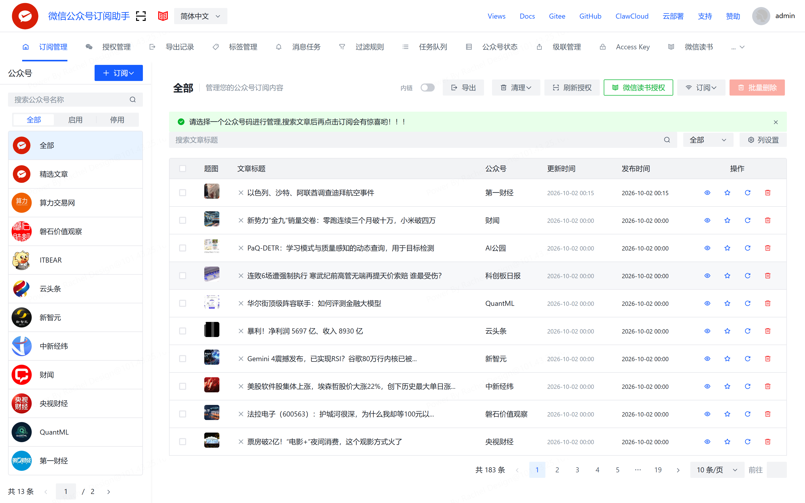
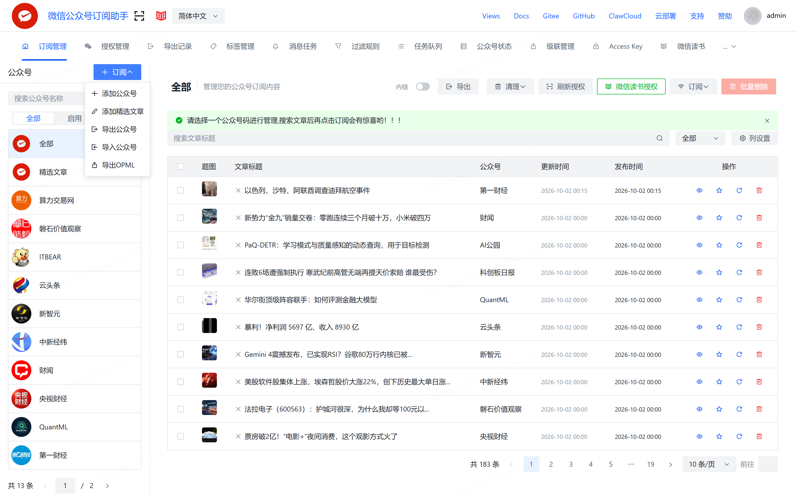
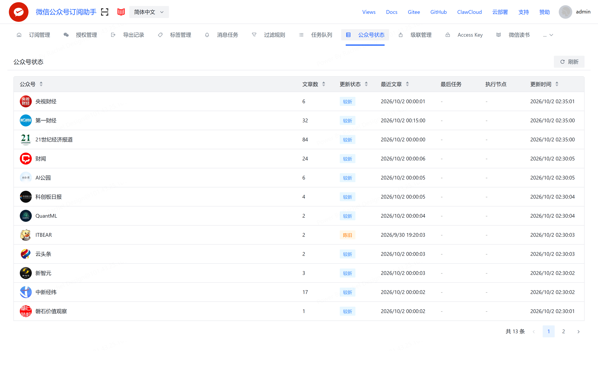
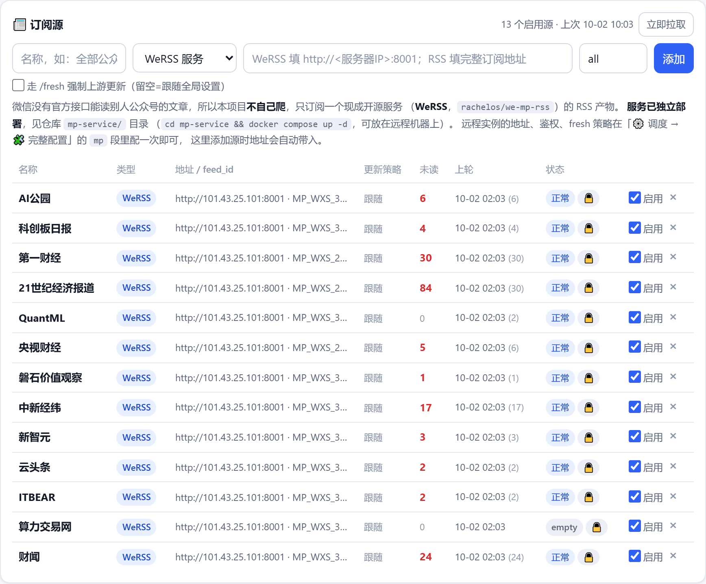
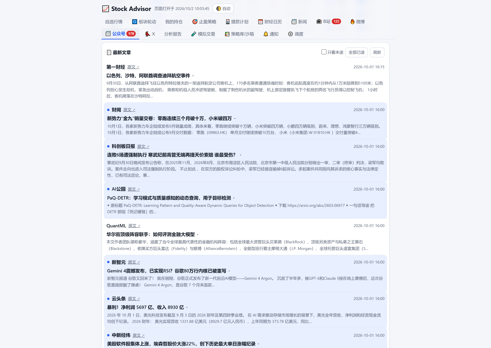
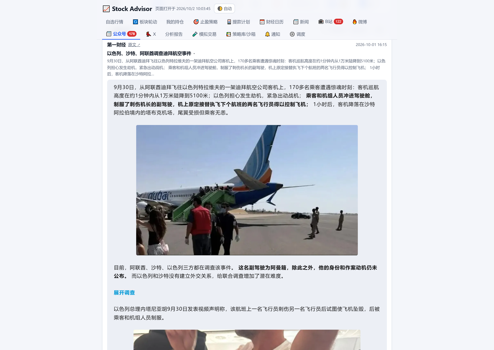

# correct_your_life

个人生活/投资辅助工具集。

## 项目结构

```
correct_your_life/
├── stock-advisor/    # 股票跟踪分析助手（FastAPI 本地服务）
├── mp-service/       # 公众号监控上游 WeRSS（独立部署，可单独放远程）
├── MediaCrawler/     # 社媒爬虫（git submodule → hellostronger/MediaCrawler）
├── DESIGN.md         # LifeReflector 个人生活反思助手设计文档（尚未实现）
└── .env              # 环境变量/密钥（不入库）
```

## 依赖关系

**stock-advisor 硬依赖 MediaCrawler**：B站动态监听（`bili_monitor.py`）和微博博主
监听（`wb_monitor.py`）以子进程方式调用本仓库根目录的 `MediaCrawler/` CLI 抓取
动态+评论，依赖其补丁版提交（适配无人值守抓取）。路径约定为
`stock-advisor/../MediaCrawler`，两者必须并列放在本仓库根目录下。

公众号与 X 监控**不依赖** MediaCrawler：
- 公众号靠 `mp-service/`（WeRSS）产出的 RSS，本项目只当客户端
- X 靠 `twscrape` 库（详见 stock-advisor README）

## Clone

```powershell
git clone --recurse-submodules https://github.com/hellostronger/correct_your_life.git
# 已 clone 过的补一步：
git submodule update --init
```

## 更新 submodule

```powershell
cd MediaCrawler
git pull            # MediaCrawler 上游更新（注意重打 stock-advisor 依赖的补丁，见其 README）
cd ..
git add MediaCrawler
git commit -m "chore: bump MediaCrawler submodule"
```
##TradingAgents-astock submodule

With MediaCrawler, \"TradingAgents-astock/\" is also mounted as a git submodule.

```powershell
cd TradingAgents-astock
uv run python main.py --ticker 688017 --date 2026-05-12
```

Update submodule:

```powershell
git submodule update --remote --merge -- TradingAgents-astock
git add TradingAgents-astock
git commit -m \"chore: bump TradingAgents-astock submodule\"
```

## Docker 一键运行

前提：已安装 Docker Desktop（Windows/Mac），MediaCrawler submodule 已就位。

```powershell
git submodule update --init      # 首次构建前
docker compose build             # 构建镜像（含 Chrome + uv + 两个项目）
docker compose up -d             # 启动，页面 http://127.0.0.1:8686/
docker compose logs -f           # 看日志
docker compose down              # 停止
```

说明：

- 镜像 = stock-advisor + MediaCrawler 一体：app 以子进程调 `uv run main.py`
  抓取，两个项目共用一套镜像环境，无需宿主机装 Python/uv/Chrome。
- **数据库**：复用根目录 `.env` 的 `DB_*`（云 PostgreSQL）。若 `DB_HOST` 是
  `127.0.0.1`，compose 会覆盖为 `host.docker.internal`（宿主机）。
- **登录态持久化**：`mediacrawler-browser/`（browser_data）挂在宿主机，重启容器
  不丢 B站/微博登录。
- **扫码登录**：容器无桌面，首次登录时二维码写成 PNG 落盘而非弹窗：

  ```powershell
  # 网页点「登录B站」并等几秒后：
  docker exec stock-advisor cat /srv/MediaCrawler/browser_data/bili_login_qrcode.png > bili_qr.png
  # 双击打开 bili_qr.png 用手机B站扫码；登录态落在 mediacrawler-browser/，之后无需再扫
  ```

- 微信通知登录的二维码由 iLink 接口直接返回 base64、在网页上显示，容器内可正常使用；
  止盈监控、邮件通知等其余功能与本地直跑一致（见 stock-advisor README）。

### 微信公众号监控：独立部署在 `mp-service/`

「📰 公众号」页要拉的是 **WeRSS**（`rachelos/we-mp-rss`，MIT）产出的 RSS —— 微信没有
官方接口能读别人公众号的文章，必须有个常驻服务去爬。它需要长期持有的登录态 +
Chromium，所以**从主 compose 里拆了出来**，单独放一个目录，可直接扔到远程机器。

#### ① 部署

```bash
cd mp-service
cp .env.example .env          # 至少改掉 WERSS_PASSWORD
docker compose up -d
# 浏览器打开 http://<服务器IP>:8001/ → 微信读书扫码登录
```

> ⚠️ **`WERSS_PASSWORD` 只在首次初始化时用来建账号**。之后再改 `.env` **不会**更新
> 已存在账号的登录密码 —— `users.password_hash` 是 bcrypt，和 `.env` 明文各走各的。
> 实测踩过：`.env` 里那个密码登不上，库里的哈希其实匹配的是旧的 `.env.bak`。
> 核对办法是拿候选密码去 `bcrypt.checkpw`，**别反复试登录**，界面会限制失败次数。

#### ② 在 WeRSS 里订阅公众号

登录进「订阅管理」，左侧是已订阅的公众号，右侧是它们抓回来的文章：



点左上角蓝色 **`+ 订阅 ▾`** 添加新号（`添加公众号` 走微信读书搜索，
`导出/导入公众号` 可以整批搬）：



抓取健不健康看顶部 **「公众号状态」** 页：`文章数 / 更新状态 / 最近文章`。
状态是 `陈旧` 说明该号上游没更新或被限流，先看这里再排查下游：



#### ③ 拿 feed_id 和 RSS 地址

| 地址 | 内容 |
|---|---|
| `/rss` | **索引**：列出全部已订阅公众号，每个 `<item>` 的 `<id>` 就是 feed_id |
| `/rss/<feed_id>` | 单个公众号，如 `/rss/MP_WXS_3898031922` |
| `/rss/all` | 所有号合并成一条流 |
| `/rss/<id>/fresh` | 先让 WeRSS 去上游抓一轮再返回（**有频率限制**，别开太勤） |

`feed_id` 形如 `MP_WXS_3898031922`（微信读书侧的公众号 id，`/rss` 索引里直接就有）。

> 🔒 `/rss` 路由**默认不鉴权**，`mp-service/README.md` 的「加固」一节讲了怎么加。
> 本仓库 101 上的部署已加 Bearer token（不带 token 实测返回 `401`），
> token 配在 stock-advisor `config.yaml` 的 `mp.auth`，两边共用。

#### ④ 在 stock-advisor 接入

先在「⚙️ 调度 → 🧩 完整配置」的 `mp` 段把 `base_url` 填成 `http://<服务器IP>:8001`
（配一次，下面添加源时地址自动预填），再回「📰 公众号」页：

| 字段 | 填什么 |
|---|---|
| 名称 | 随便起，只是页面显示用 |
| 类型 | `WeRSS 服务`；订别的 RSS 用 `任意 RSS 地址` |
| 地址 | `http://<服务器IP>:8001`（已配 `base_url` 会预填） |
| feed_id | 单个号填 `MP_WXS_xxx`，填 `all` = 订阅全部 |



表下方是**已接入的源**：未读数、上轮拉取时间、状态一目了然，
右侧可单个启停/删除，右上角「立即拉取」手动触发一轮。

#### ⑤ 看文章：标题点开就是全文

列表里标题后的 `▾` 表示**库里存了正文**，点标题就地展开，不用跳回微信：



展开后是完整原文，配图**按需**转 base64 内嵌 —— 只在你点开那篇时才生成。
实测 60 篇列表带 `content_text` 是 100 KB、改成带正文 HTML 是 784 KB、
再把 230 张图全内嵌要 36.5 MB，所以这一步放在展开时做：



> 摘要和正文是两回事：RSS 的 `summary` 有时**只有标题大小**，
> 这种情况页面自动回落到 `content_text` 的前几百字做预览，不会出现标题重复两遍。

---

两边**不共享配置与数据**。完整部署/运维/换 MySQL/从源码构建见 `mp-service/README.md`。

不装 WeRSS 也能用 —— 公众号页支持粘贴任意 RSS 地址。

### X(Twitter) 监控

「🐦 X」页用 `twscrape` 监控指定用户的推文。容器内外都需要先装依赖（带 curl 后端，
X 会做 TLS 指纹识别）：

```bash
pip install "twscrape[curl]"
```

然后在网页里粘贴自己 X 账号的 `auth_token=…; ct0=…` cookie。
Nitter 已于 2026-09 被 X Corp 要求下架、snscrape/Twint 随匿名 guest token 关闭
一起失效，twscrape 是目前唯一可用的开源免费方案。

## 使用

见 [stock-advisor/README.md](stock-advisor/README.md)（行情、持仓、分析报告、
B站/微博动态监听、通知推送、止盈策略）。
